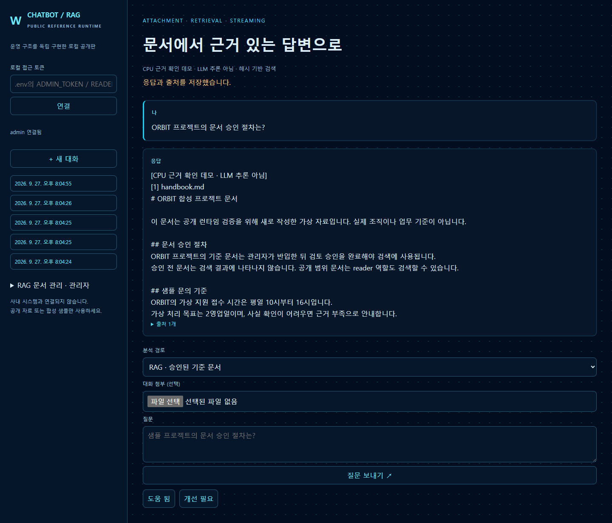

# Chatbot + RAG Runtime

**실행 가능한 공개 참조 구현** — 대화별 첨부 분석과 승인 문서 기반 RAG를 구분하고,
대화·출처를 PostgreSQL에 저장하며 SGLang 호환 모델의 응답을 스트리밍합니다.

[포트폴리오](https://woonjang.dev/) · [별도 웹 체험](https://chat.woonjang.dev/)



이 저장소는 사내 운영 저장소를 공개 전환하거나 복제한 것이 아닙니다.
공개된 아키텍처의 핵심 경로를 **새로 구현**했습니다. 사내 문서·사용자 계정·키·서버 주소,
운영 설정 및 원본 Git 이력은 포함하지 않습니다. `samples/`는 새로 작성한 합성 문서입니다.

## 빠른 실행

Docker Desktop 또는 Docker Engine + Compose, Python 3.12 이상이 필요합니다.

```sh
git clone https://github.com/wkddns40/chatbot-rag-runtime.git
cd chatbot-rag-runtime
python setup.py
docker compose up --build -d --wait
```

1. `http://localhost:8080`을 엽니다.
2. 로컬 `.env`의 `ADMIN_TOKEN`으로 연결합니다. 토큰은 매 설치마다 무작위 생성되며 저장소에 포함되지 않습니다.
3. **RAG 문서 관리**에서 `samples/handbook.md`를 `public` 범위로 반입합니다.
4. **승인 및 색인**을 누른 뒤 “ORBIT 프로젝트의 문서 승인 절차는?”을 질문합니다.
5. 출처를 펼치고 새로고침 후 재연결하여 대화 이력이 보존되는지 확인합니다.
6. `samples/admin-only.md`를 `admin` 범위로 승인한 후 `READER_TOKEN`으로 연결하면 해당 문서는 검색되지 않습니다.

`setup.py`는 기존 `.env`를 덮어쓰지 않습니다. 토큰은 브라우저 메모리에만 보관하며 새로고침하면 재입력합니다.
`public` ACL은 **이 로컬 런타임에 인증된 두 역할**을 뜻하며 인터넷 익명 공개를 뜻하지 않습니다.

## 두 실행 모드

| 모드 | 기본 CPU 모드 | 사용자 모델 연결 |
| --- | --- | --- |
| 추론 | 근거 발췌 데모, **LLM 추론 아님** | 실제 `/chat/completions` SSE 응답 |
| 임베딩 | 재현 가능한 문자 bigram 해시, **의미 임베딩 아님** | 선택한 `/embeddings` 서비스 |
| 저장·승인·ACL·검색 | 실제 PostgreSQL + Qdrant | 동일 |
| GPU / 모델 다운로드 | 필요 없음 | 사용자가 별도로 준비 |

CPU 모드는 실행·권한·저장 경로 검증용이며 모델 지능이나 검색 품질의 평가용이 아닙니다.
실제 모델 연결 실패 시 데모 답변으로 자동 대체하지 않고 오류를 표시합니다.

## SGLang 연결

자신이 운영하는 [SGLang의 OpenAI 호환 API](https://docs.sglang.ai/basic_usage/openai_api.html)를 사용합니다.
모델 가중치, GPU 컨테이너 및 운영용 서버 설정은 배포하지 않습니다.

`.env`를 편집합니다. 다음 호스트는 Docker의 로컬 호스트 별칭이며 사내 서버 주소가 아닙니다.

```dotenv
LLM_BASE_URL=http://host.docker.internal:8000/v1
LLM_API_KEY=YOUR_OWN_LOCAL_SERVICE_KEY
LLM_MODEL=glm-5.3-flash
```

`LLM_MODEL`은 자신의 SGLang `served-model-name`과 일치시킵니다. 실제 모델 실행에 필요한 GPU·메모리,
모델 라이선스 및 양자화 호환성은 사용자 환경에서 확인해야 합니다. 이 저장소는 SGLang 엔진을 대체하지 않습니다.

선택적으로 의미 임베딩도 연결할 수 있습니다.

```dotenv
EMBED_BASE_URL=http://host.docker.internal:8001/v1
EMBED_API_KEY=YOUR_OWN_LOCAL_SERVICE_KEY
EMBED_MODEL=YOUR_EMBEDDING_MODEL
EMBED_DIM=384
```

```sh
docker compose up -d --force-recreate app
```

임베딩 주소·모델·차원을 바꾸면 별도 Qdrant 컬렉션을 사용합니다. 문서는 새 설정으로 다시 승인·색인해야 검색됩니다.
이미 승인된 문서는 관리 화면의 **다시 색인** 버튼을 누릅니다.
파일 내용·질문·대화 이력은 설정한 모델/임베딩 서비스로 전달됩니다. 외부 제공자를 설정하기 전 해당 데이터 정책을 확인하세요.

## 실행 경로

| 기능 | 경로 |
| --- | --- |
| 일반 대화 | UI → 인증 → 최근 대화 → 모델 SSE → PostgreSQL |
| 첨부 분석 | TXT / Markdown / 텍스트 PDF → 대화 소유권 검사 → 해당 대화에서만 근거 구성 |
| 영구 RAG 반입 | 관리자 업로드 → 승인 대기 → 청킹 → 임베딩 → Qdrant 색인 → 승인 확정 |
| RAG 응답 | 인증된 역할 → Qdrant ACL 선필터 → PostgreSQL 승인·ACL 재검사 → 근거·출처 → 모델 |
| 이력·피드백 | 역할별 대화 소유권 검사 → PostgreSQL 저장 |

API 계약은 `/openapi.json`에서 확인할 수 있습니다. 인증은 `Authorization: Bearer <로컬 토큰>`입니다.
DB와 Qdrant 포트는 호스트에 노출하지 않으며 UI/API는 기본적으로 `127.0.0.1:8080`에만 바인딩합니다.

## 검증

```sh
docker compose exec -T app python -m unittest discover -s tests -v
python scripts/check_public.py
```

테스트는 인증 거부, 대화 소유권, 미승인 문서 차단, ACL, 첨부 격리, 출처·이력 저장,
잘못된 업로드, SSE 전달 및 중단 시 저장 방지를 검증합니다. 스트리밍 테스트는 **테스트용 로컬 API 서버**를 사용하며
실제 GLM 모델 품질·GPU 성능을 검증했다는 의미가 아닙니다. 테스트는 합성 데이터를 추가하므로 실제 자료가 없는 개발 환경에서 실행하세요.

## 운영판과의 차이 / 보안 경계

- 두 개의 합성 역할(admin/reader)로 권한 경로를 재현합니다. 실제 직원 계정·SSO·MFA·조직 권한 동기화는 포함하지 않습니다.
- 단일 API worker와 동시 생성 2개 제한을 사용합니다. 운영용 PostgreSQL FIFO, 다중 GPU 라우팅, MTP, HA는 구현하지 않습니다.
- TXT/Markdown/텍스트 PDF만 지원합니다. 최대 2MB·40페이지·40,000자, 대화당 첨부 3개입니다. OCR·이미지·오피스 문서·웹 검색은 포함하지 않습니다.
- 근거 검색은 벡터 top-5입니다. 운영용 재순위화, 벤치마크, 의미적 답변 정확성 보장은 포함하지 않습니다.
- 문서 내용은 신뢰하지 않는 근거로 모델에 전달합니다. 프롬프트 주입을 완전히 차단하지 못하며 모델 출력은 검토해야 합니다.
- 로컬 신뢰 사용자용 참조 런타임입니다. PDF 파서를 별도 프로세스로 격리하지 않으며 인터넷에 직접 공개하면 안 됩니다.
  공개 서비스화에는 TLS, OIDC, 사용자별 ACL, 요청·업로드 제한, parser sandbox, 악성 파일 검사, 관측·백업 정책을 별도로 적용하세요.
- API 토큰·모델 키는 로그나 오류 본문에 출력하지 않습니다. `.env`, DB 볼륨, 사용자 업로드는 공개 대상이 아닙니다.
- 문서 버전은 업로드별 UUID/생성일입니다. 자동 중복 제거·버전 대체·삭제 UI는 포함하지 않습니다.
- 문맥은 최근 메시지 12개(각 4,000자), 첨부당 첫 8,000자, RAG top-5 청크로 제한합니다. 긴 문서 전체를 분석했다고 해석하지 마세요.

## 종료와 데이터

```sh
docker compose stop
```

다시 실행하면 기존 볼륨의 대화·문서가 유지됩니다. `docker compose down`도 데이터 볼륨을 보존합니다.
`docker compose down --volumes`는 **이 프로젝트의 대화·문서·색인을 모두 삭제**하므로 필요한 데이터를 백업한 뒤에만 사용하세요.

## 출처와 라이선스

[Qdrant ACL 필터](https://qdrant.tech/documentation/search/filtering/)와
[SGLang 호환 API](https://docs.sglang.ai/basic_usage/openai_api.html)를 사용합니다.
본 저장소의 신규 코드와 합성 샘플은 MIT 라이선스입니다. 모델·컨테이너·라이브러리의 라이선스는 각각 별도입니다.
